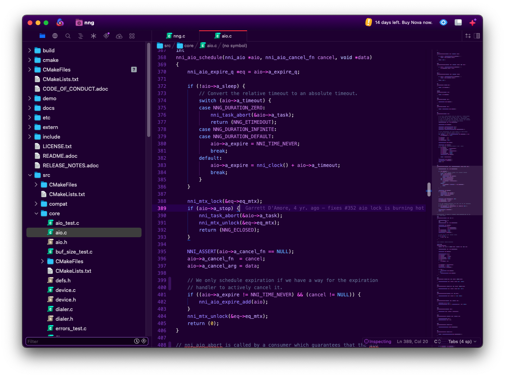

# C Syntax for Nova

**C** provides syntax highlighting and autocompletion for **C** making use of Tree-Sitter.

This supports the C11 variant of the language.

This is just the basics, and for full functionality should
be paired with the clangd language server.

## Building

If you want to build this, you will need the tree-sitter-c
repository, and will need to build the parser using the
supplied compile.sh and Makefile.

1. git clone https://github.com/tree-sitter/tree-sitter-c
2. ./compile.sh ./tree-sitter-c /Applications/Nova.app
3. cp build/*.dylib ./Syntaxes

## Future Directions

It would be good to add folding and symbolication.
This is merely a first pass.
